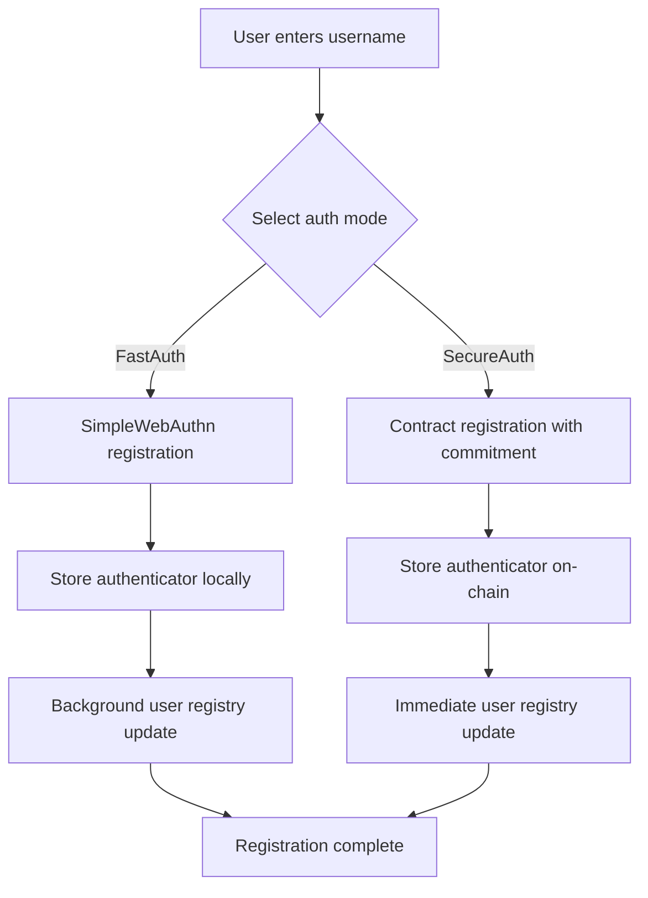
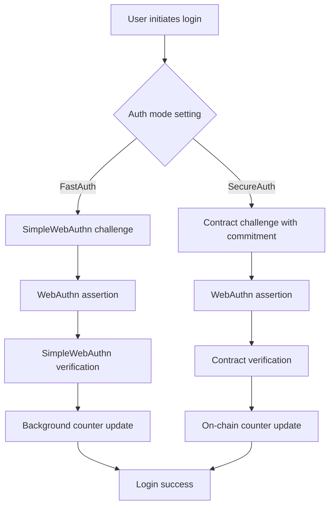
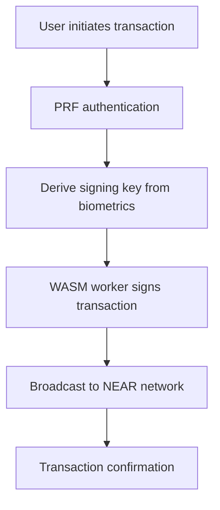

# NEAR Passkey Authentication System

A comprehensive WebAuthn passkey authentication system built for NEAR blockchain, featuring dual-mode authentication, client-side user management, and decentralized identity.

## Key Features

### **Dual-Mode Authentication**
- **FastAuth (Optimistic)**: Instant response with background blockchain updates
- **SecureAuth (Contract Sync)**: Full on-chain verification before response
- **User-configurable**: Toggle between modes based on preference

### **Decentralized User Management**
- **Client-side state**: No server dependency for user data
- **On-chain registry**: Decentralized user existence tracking
- **Multi-user support**: Multiple NEAR accounts per device
- **Privacy-focused**: Personal data stays local

### **Advanced Passkey Features**
- **PRF (Pseudo-Random Function)**: Secure key derivation from biometrics
- **WASM crypto worker**: Isolated key management and transaction signing
- **Cross-device sync**: Passkey backup and recovery support
- **Resident keys**: No username required for login

## 📱 User Experience Flows

### **Registration Flow**



**FastAuth Registration:**
1. User enters username and selects "Fast Auth (Optimistic)"
2. WebAuthn credential creation with PRF extension
3. SimpleWebAuthn verification (instant)
4. Store authenticator in local database
5. Background contract update (fire-and-forget)
6. Immediate success response

**SecureAuth Registration:**
1. User enters username and selects "Secure Auth (Contract Sync)"
2. Contract generates on-chain commitment
3. WebAuthn credential creation
4. Full contract verification with commitment validation
5. Store authenticator on-chain
6. User registry automatically updated
7. Success response after contract confirmation

### **Authentication Flow**



**FastAuth Authentication:**
- Instant challenge generation
- Local credential verification
- Background authenticator counter update
- Immediate login success

**SecureAuth Authentication:**
- On-chain commitment creation
- Contract-based challenge verification
- Synchronous authenticator updates
- Login success after blockchain confirmation

### **Transaction Signing Flow**



1. User requests transaction (e.g., "Set Greeting")
2. PRF-enabled passkey authentication
3. Secure key derivation in WASM worker
4. Transaction signing with derived key
5. Direct broadcast to NEAR RPC
6. Success confirmation

## Architecture Overview

### **Client-Side Components**
- **ClientUserManager**: Local user data and preferences

- **PasskeyContext**: React state management
- **SettingsContext**: User preferences and mode selection

### **Server Components**
- **Dual-mode routes**: Registration and authentication endpoints
- **Background workers**: Optimistic contract updates
- **Challenge store**: Temporary challenge management
- **Authenticator service**: Credential management

### **Smart Contract**
- **User registry**: On-chain user existence tracking
- **Authenticator storage**: WebAuthn credential management
- **Activity tracking**: Usage analytics and timestamps
- **Security validation**: Commitment-based verification


## Getting Started

### Prerequisites

- [Node.js](https://nodejs.org/) (v18.x or later recommended)
- [pnpm](https://pnpm.io/) (v8.x or later recommended)
- [Caddy](https://caddyserver.com/docs/install) (for HTTPS development)
- [Rust](https://www.rust-lang.org/tools/install) (for WASM module)
- [wasm-pack](https://rustwasm.github.io/wasm-pack/installer/) (for WASM building)

### Installation

```bash
# Install all dependencies
pnpm install-all

# Build WASM crypto worker
pnpm build-wasm
```

### Development

```bash
# Start frontend (https://example.localhost)
pnpm dev

# Start backend (http://localhost:3000)
pnpm server
```

### Testing

```bash
# Test smart contract
cd webauthn-contract && cargo test

# Test user registry
cargo test test_user_registry

# Test authentication flows
cargo test test_authentication
```
