# NEAR Passkey Authentication System

A comprehensive WebAuthn passkey authentication system built for NEAR blockchain, featuring **VRF-based challenge generation**, **encrypted keypair management**, and **Web Worker security architecture**.

## Key Features

### **VRF-Based Authentication**
- **VRF Registration**: One-time setup generating encrypted VRF + WebAuthn credentials
- **VRF Login**: Session initialization decrypting VRF keypair into worker memory
- **VRF Authentication**: Stateless challenge generation for NEAR transactions
- **Single TouchID per operation**: Streamlined UX with minimal user prompts

### **Web Worker Security Architecture**
- **WASM Isolation**: VRF operations executed in isolated WASM linear memory
- **Encrypted Storage**: VRF keypairs encrypted with WebAuthn PRF at rest
- **Session-Based**: VRF keypair persists in worker memory during browser session
- **Zero Server Dependency**: Complete client-side operation

### **Advanced Passkey Features**
- **PRF (Pseudo-Random Function)**: Secure key derivation from biometrics
- **Dual PRF Support**: Separate AES and Ed25519 key derivation channels
- **Cross-device sync**: Passkey backup and recovery support
- **Deterministic keys**: Same passkey always derives same NEAR keypair

## 📱 VRF Authentication Flows

### **Flow 1: VRF Registration** (First-time setup)

```mermaid
sequenceDiagram
    participant Client
    participant WASM as WASM Worker
    participant NEAR as NEAR RPC
    participant Contract as Web3Authn Contract

    Note over Client: 1. Get NEAR block data for freshness
    Client->>NEAR: 2. Get latest block (height + hash)
    NEAR->>Client: 3. Block height + hash
    Note over Client: 4. Generate VRF keypair and challenge (bootstrap)
    Client->>WASM: 5. generateVrfKeypair(saveInMemory=true, vrfInputs)
    WASM->>WASM: 6. Generate VRF keypair + persist in memory
    WASM->>WASM: 7. Generate VRF challenge with domain separation
    WASM->>Client: 8. VRF challenge data (keypair stored in memory)
    Note over Client: 9. WebAuthn registration ceremony with VRF challenge
    Client->>Client: 10. WebAuthn registration with PRF (TouchID)
    Note over Client: 11. Encrypt VRF keypair with PRF output
    Client->>WASM: 12. encryptVrfKeypairWithPrf(expectedPublicKey, prfOutput)
    WASM->>WASM: 13. Verify public key matches stored keypair
    WASM->>WASM: 14. Encrypt VRF keypair with AES-GCM + HKDF
    WASM->>Client: 15. Encrypted VRF keypair for storage
    Client->>Client: 16. Store encrypted VRF keypair in IndexedDB
    Client->>Contract: 17. verify_registration_response(registration, vrf_proof, vrf_pubkey, vrf_input)
    Contract->>Contract: 18. Verify VRF proof ✓
    Contract->>Contract: 19. Extract challenge from VRF output
    Contract->>Contract: 20. Verify WebAuthn registration ✓
    Contract->>Contract: 21. Store VRF pubkey + authenticator on-chain
    Contract->>Client: 22. Registration complete ✅
```



**Key Optimization**: Only **ONE TouchID prompt** during entire registration process.

### **Flow 2: VRF Login** (Session initialization)

```mermaid
sequenceDiagram
    participant Client
    participant WebWorker as VRF Web Worker

    Note over Client: 🔐 Login Flow: Unlock VRF Keypair
    Note over Client: 1. User initiates login session
    Note over Client: 2. WebAuthn authentication with PRF (TouchID #1)
    Note over Client: 3. Derive AES key from PRF output
    Client->>Client: 4. Retrieve encrypted VRF keypair from IndexedDB
    Client->>WebWorker: 5. Initialize VRF Web Worker
    WebWorker->>WebWorker: 6. Load VRF WASM module
    Client->>WebWorker: 7. Send unlock request with PRF key + encrypted data
    WebWorker->>WebWorker: 8. Decrypt VRF keypair with derived AES key
    WebWorker->>WebWorker: 9. VRF keypair loaded into WASM memory
    WebWorker->>Client: 10. VRF session active confirmation
    Note over WebWorker: ✅ VRF keypair ready for challenge generation
    Note over Client: Session active - no more TouchID needed for challenges
```



### **Flow 3: VRF Authentication** (NEAR transactions)

```mermaid
sequenceDiagram
    participant Client
    participant WebWorker as VRF Web Worker
    participant NEAR as NEAR RPC
    participant Contract as Web3Authn Contract

    Note over Client: 🔁 Authentication Flow (e.g. signing transactions)
    Client->>NEAR: 1. Get latest block (height + hash)
    Note over Client: 2. Construct VRF input with domain separator
    Client->>WebWorker: 3. Send challenge generation request
    WebWorker->>WebWorker: 4. Generate VRF proof + output (no TouchID needed)
    WebWorker->>Client: 5. VRF challenge (bincode serialized) + proof
    Note over Client: 6. Use VRF output as WebAuthn challenge
    Note over Client: 7. WebAuthn authentication ceremony (TouchID #1)
    Client->>Contract: 8. verify_authentication_response(authentication, vrf_proof, vrf_pubkey, vrf_input)
    Contract->>Contract: 9. Verify VRF proof ✓
    Contract->>Contract: 10. Extract challenge from VRF output
    Contract->>Contract: 11. Read stored VRF pubkey + authenticator
    Contract->>Contract: 12. Verify VRF pubkey matches stored ✓
    Contract->>Contract: 13. Verify WebAuthn authentication ✓
    Contract->>Client: 14. Authentication complete ✅
```



## Architecture Overview

### **VRF Challenge Construction**
Secure input construction with domain separation:

```rust
let domain = b"web_authn_challenge_v1";
let input_data = [
    domain,
    user_id.as_bytes(),
    rp_id.as_bytes(),
    session_id.as_bytes(),
    &block_height.to_le_bytes(),
    &block_hash,
    &timestamp.to_le_bytes(),
].concat();

let vrf_input = sha2::Sha256::digest(&input_data);
let (vrf_output, vrf_proof) = vrf_keypair.prove(&vrf_input);
// The vrf_output becomes the WebAuthn challenge
```

### **Security Guarantees**
- ✅ **No challenges without user consent** (login required)
- ✅ **Each auth gated by TouchID** (WebAuthn ceremony)
- ✅ **Verifiably random challenges** (VRF proof)
- ✅ **Encrypted at rest** (AES-GCM with PRF-derived key)
- ✅ **WASM memory isolation** (VRF keys secured in linear memory)
- ✅ **Block freshness** (NEAR block data prevents replay)
- ✅ **Fork protection** (Block hash prevents cross-fork reuse)

### **Client-Side Components**
- **VRF Manager**: Client interface for VRF operations
- **VRF Web Worker**: WASM-based VRF keypair management
- **PasskeyManager**: Unified passkey and VRF operations
- **IndexedDB Storage**: Encrypted VRF keypair persistence
- **Dual PRF Support**: Separate AES/Ed25519 key derivation

### **Smart Contract**
- **VRF Verification**: On-chain VRF proof validation
- **Authenticator Storage**: WebAuthn credential management
- **User Registry**: Decentralized user existence tracking
- **Challenge Validation**: VRF input/output verification

## Getting Started

### Prerequisites

- [Node.js](https://nodejs.org/) (v18.x or later recommended)
- [pnpm](https://pnpm.io/) (v8.x or later recommended)
- [Caddy](https://caddyserver.com/docs/install) (for HTTPS development)
- [Rust](https://www.rust-lang.org/tools/install) (for WASM modules)
- [wasm-pack](https://rustwasm.github.io/wasm-pack/installer/) (for WASM building)

### Installation

```bash
# Install all dependencies
pnpm install-all

# Build WASM VRF and signer workers
pnpm build-wasm
```

### Development

```bash
# Start frontend (https://example.localhost)
pnpm dev

# Start backend (http://localhost:3000)
pnpm server
```

### Testing

```bash
# Test smart contract
cd webauthn-contract && cargo test

# Test VRF operations
cargo test test_vrf_

# Test authentication flows
cargo test test_authentication
```

## VRF Integration

### Basic Usage

```typescript
import { PasskeyManager } from '@web3authn/passkey';

// Initialize with VRF support
const passkeyManager = new PasskeyManager(config, nearRpcProvider);
await passkeyManager.initializeVRFWorker();

// Registration (first-time user)
const result = await passkeyManager.registerPasskey('alice.testnet', {
  onEvent: (event) => console.log('Registration event:', event)
});

// Login (session initialization)
const loginResult = await passkeyManager.loginPasskey('alice.testnet');

// Authentication (ongoing operations)
const authResult = await passkeyManager.authenticateWithVRF(
  'alice.testnet',
  crypto.randomUUID(), // sessionId
  { verifyWithContract: true }
);
```

### Worker File Setup

VRF functionality requires hosting Web Worker files:

```bash
# Copy VRF worker files to public directory
cp node_modules/@web3authn/passkey/dist/vrf-worker.js public/workers/
cp node_modules/@web3authn/passkey/dist/wasm_vrf_worker_bg.wasm public/workers/

# Or use the provided copy script
./node_modules/@web3authn/passkey/scripts/copy-wasm-assets.sh
```

For detailed VRF implementation, see [docs/vrf_challenges.md](docs/vrf_challenges.md).
