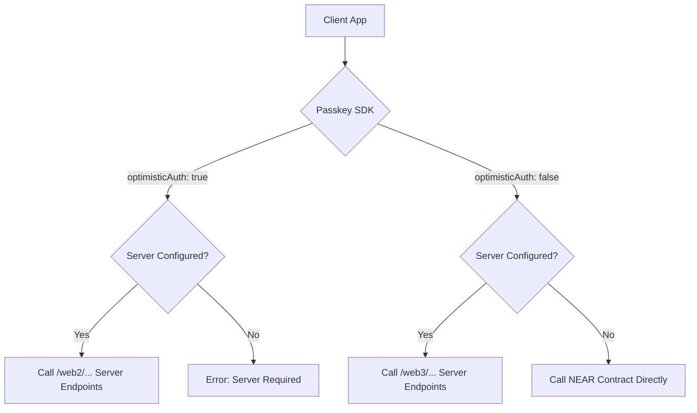

# Refactoring Plan: Client-Side Optimistic Authentication

## 1. Objective
Relocate the business logic for selecting between "optimistic" (Web2-style, fast) and "secure" (Web3-style, on-chain) WebAuthn flows from the server to the `packages/passkey` client SDK. This change will empower the SDK to operate in a fully decentralized, "serverless" mode by interacting directly with the NEAR smart contract.

## 2. Core Principles
- **Client-Side Control**: The SDK, configured by the developer, will determine the authentication strategy (`optimistic` vs. `secure`).
- **Decoupled Server**: The server will no longer contain strategy-switching logic. Instead, it will expose discrete, single-purpose endpoints for each flow.
- **Serverless Fallback**: If no server is configured in the SDK, it will default to the secure, on-chain (Web3) flow by calling the smart contract directly.

## 3. New Architecture Flow
The SDK will route requests based on its configuration:

## 4. Step-by-Step Implementation Plan

### Step 1: Update SDK Configuration
- Modify `PasskeyManagerConfig` in `packages/passkey/src/core/PasskeyManager/types.ts` to accept an optional `serverUrl`.
- Update the `PasskeyProvider` in `packages/passkey/src/react/context/PasskeyContext.tsx` to accept `serverUrl` as a prop and pass it to the `PasskeyManager`.

### Step 2: Implement Direct Contract Calls in SDK
- **Priority**: Enable serverless mode by replicating web3 contract calls directly in the SDK.
- **Approach**: Instead of refactoring server endpoints first, implement direct NEAR contract interaction in the passkey SDK.

    - **Contract Call Replication**:
        - Extract contract call logic from server routes (`registration.ts`, `authentication.ts`)
        - Implement direct contract calls in `packages/passkey/src/core/ContractService.ts`
        - Support both `generate_registration_options`/`verify_registration_response` and `generate_authentication_options`/`verify_authentication_response`

    - **Server Refactoring (Future)**:
        - Once SDK serverless mode is working, optionally refactor server to use dedicated `web2`/`web3` endpoints
        - This becomes a server optimization rather than a blocking requirement for serverless mode

### Step 3: Integrate Contract Service into SDK Logic ✅ COMPLETED
- ✅ Modified the `registerPasskey` and `loginPasskey` functions in `packages/passkey/src/core/PasskeyManager/`.
- ✅ Implemented complete serverless functionality:
    - **If `optimisticAuth: true` is requested:**
        - ✅ Checks if `config.serverUrl` is provided. If not, throws an error, as the optimistic flow requires a server.
        - ✅ Makes API calls to the existing server endpoints (current behavior).
    - **If `optimisticAuth: false` is requested (Secure Mode):**
        - ✅ **With Server:** If `config.serverUrl` is provided, makes API calls to existing server endpoints.
        - ✅ **Without Server (Serverless):** If `config.serverUrl` is *not* provided, the SDK:
            1. ✅ Uses the new `ContractService` to call NEAR contract methods directly
            2. ✅ Handles argument building, response parsing, and error handling locally
            3. ✅ Maintains compatibility with existing WebAuthn flows
            4. ✅ Supports both registration and authentication flows
            5. ✅ Integrates with local IndexedDB cache for authenticator data
            6. ✅ Supports transaction signing/actions in serverless mode (direct NEAR RPC calls)

### Step 4: Update Documentation
- Update this file (`optimistic_auth.md`) to document progress on the plan.
- Briefly Update `README.md` to explain the new `serverUrl` configuration.
- Document the two operational modes (server-assisted vs. serverless) and their use cases.

## 5. Implementation Details

### Contract Service Architecture

The new `ContractService` will replicate the following server functionality:

#### Registration Flow (Serverless)
1. **Generate Registration Options**:
   - Extract logic from `server/src/routes/registration.ts:getRegistrationOptionsContract()`
   - Build `ContractGenerateOptionsArgs` from user input
   - Call `generate_registration_options` on NEAR contract
   - Parse and return WebAuthn options

2. **Verify Registration Response**:
   - Extract logic from `server/src/routes/registration.ts:verifyRegistrationResponseContract()`
   - Build `ContractCompleteRegistrationArgs` from WebAuthn response
   - Call `verify_registration_response` on NEAR contract
   - Handle success/failure and return verification result

#### Authentication Flow (Serverless)
1. **Generate Authentication Options**:
   - Extract logic from `server/src/routes/authentication.ts:generateAuthenticationOptionsContract()`
   - Build `ContractGenerateAuthOptionsArgs` from authenticator data
   - Call `generate_authentication_options` on NEAR contract
   - Parse and return WebAuthn options

2. **Verify Authentication Response**:
   - Extract logic from `server/src/routes/authentication.ts:verifyAuthenticationResponseContract()`
   - Build verification args from WebAuthn response
   - Call `verify_authentication_response` on NEAR contract
   - Handle success/failure and return verification result

### Key Benefits
- **True Serverless Operation**: SDK can work without any server infrastructure
- **Reduced Server Complexity**: Server becomes optional for optimistic flows only
- **Better Developer Experience**: Single SDK configuration controls all behavior
- **Improved Decentralization**: Direct contract interaction aligns with Web3 principles

## 6. Step 6: Refactor Client-Side Routing Logic ✅ COMPLETED

### Implementation Completed ✅
- ✅ **Created Routing Utilities** (`packages/passkey/src/core/utils/routing.ts`):
   - ✅ `determineOperationMode()`: Analyzes config and returns operation mode
   - ✅ `buildServerUrl()`: Constructs appropriate server endpoints
   - ✅ `validateModeRequirements()`: Checks if mode requirements are met
   - ✅ `getModeDescription()`: Provides user-friendly logging descriptions
   - ✅ `RoutingErrors`: Standardized error messages

### Benefits Achieved ✅
- ✅ **Code Organization**: Separated routing concerns from core WebAuthn functionality
- ✅ **Maintainability**: Centralized mode determination and URL construction
- ✅ **Testability**: Enabled unit testing of routing logic independently
- ✅ **Consistency**: Standardized error messages and validation across all functions
- ✅ **Type Safety**: Strong TypeScript types for operation modes and routing results

## 7. Implementation Status Summary

### ✅ FULLY COMPLETED - Serverless Mode Implementation

The optimistic authentication refactoring plan has been **successfully completed**. The passkey SDK now supports three operational modes:

#### 🚀 **Web2 Mode (Optimistic)**
- **Trigger**: `optimisticAuth: true` + `serverUrl` provided
- **Behavior**: Fast authentication via server endpoints
- **Use Case**: Development and applications prioritizing speed

#### 🔒 **Web3 Mode (Secure)**
- **Trigger**: `optimisticAuth: false` + `serverUrl` provided
- **Behavior**: On-chain verification via server endpoints
- **Use Case**: Production applications with server infrastructure

#### ⚡ **Serverless Mode (Decentralized)**
- **Trigger**: `optimisticAuth: false` + no `serverUrl`
- **Behavior**: Direct NEAR contract interaction
- **Use Case**: Fully decentralized applications, edge deployments

### Key Achievements ✅

1. **Complete Serverless Functionality**:
   - ✅ Registration: Direct contract calls for WebAuthn credential registration
   - ✅ Authentication: Direct contract calls for WebAuthn credential verification
   - ✅ Actions: Transaction signing with PRF-derived keys + direct NEAR RPC
   - ✅ Local caching: IndexedDB for authenticator data and user preferences

2. **Robust Architecture**:
   - ✅ ContractService: Replicates server contract logic with identical argument building
   - ✅ Type Safety: Comprehensive TypeScript types for all contract interactions
   - ✅ Error Handling: Server-equivalent error parsing and user-friendly messages
   - ✅ Routing Logic: Clean separation of concerns with utility functions

3. **Developer Experience**:
   - ✅ Single Configuration: `serverUrl` optional parameter controls all behavior
   - ✅ Backward Compatibility: Existing server-based applications continue working
   - ✅ Clear Documentation: Mode descriptions and error messages guide usage
   - ✅ Build Success: All implementations compile without TypeScript errors

### Next Steps (Optional)
The core implementation is complete. Future enhancements could include:
- Server endpoint refactoring to use dedicated `web2`/`web3` routes
- Additional contract method support
- Performance optimizations
- Enhanced error recovery mechanisms